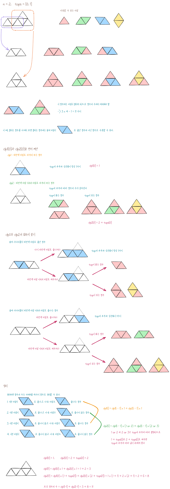

## < 16주차 회고 (2024 KAKAO WINTER INTERNSHIP)) >
---
### [16주차] 해결한 과제
##### 가장 많이 받은 선물
- https://school.programmers.co.kr/learn/courses/30/lessons/258712

**<접근 방법>**  
  
- 주어진 입력을 가지고 선물 지수를 나타내는 리스트와 누가 선물을 주고 누가 선물을 받았는지 테이블 형태의 2차원 리스트를 만듭니다.
- 임의의 두 사람 사이의 선물을 주고 받은 내역을 확인했을 때, 선물을 더 많이 준 사람이 받는 선물을 +1을 해줍니다. 
    - 만약에 선물을 주고 받은 개수가 같은 경우에는 선물 지수를 확인하고 선물 지수가 큰 사람이 작은 사람에게 하나를 받게 +1을 해줍니다.

---

##### 도넛과 막대 그래프
- https://school.programmers.co.kr/learn/courses/30/lessons/258711

**<접근 방법>**  
  
- 주어진 조건에 따라서 각 노드별로 나가는 간선과 들어오는 간선의 개수를 계산합니다. 그런 뒤, 생성된 노드와 막대 그래프, 8자 그래프, 도넛형 그래프에서만 볼 수 있는 각각의 조건을 찾은 뒤 그 조건을 만족하는 노드의 개수를 구하면 해당 그래프의 개수가 됩니다.
    - 생성된 노드 : 들어오는 간선은 없고 나가는 간선이 2개 이상이면 그 노드가 생성된 노드라고 할 수 있습니다.
    - 막대 그래프 : 막대 그래프의 마지막 노드는 들어오는 간선이 한 개 있고 나가는 간선이 없습니다. 이런 노드가 있다면 막대 그래프가 하나 있는 걸로 생각할 수 있습니다.
    - 8자 그래프 : 8자 그래프의 중심 노드는 항상 나가는 간선이 2개 있고, 들어오는 간선이 2개 있습니다. 이런 노드가 있다면 8자 그래프가 하나 있는 걸로 생각할 수 있습니다.
    - 도넛형 그래프 : 모든 그래프는 생성된 노드와 연결되어 있으므로, 생성된 노드에서 나가는 간선의 개수에다가 막대 그래프의 개수, 8자 그래프의 개수를 빼주면 도넛형 그래프의 개수가 됩니다.

---

##### 산 모양 타일링
- https://school.programmers.co.kr/learn/courses/30/lessons/258705

**<접근 방법>**  
  
- 동적 계획법을 이용한 타일링 문제였습니다. 다른 사람의 풀이를 참고해서 풀었습니다.

---
---
### [16주차] 해결하지 못한 과제
##### 주사위 고르기
- https://school.programmers.co.kr/learn/courses/30/lessons/42860

**<접근 방법>**  
  
- 

---
##### n + 1 카드 게임
- https://school.programmers.co.kr/learn/courses/30/lessons/258707

**<접근 방법>**
  
- 

---
---
### [16주차] 처음 써본 함수 및 라이브러리

